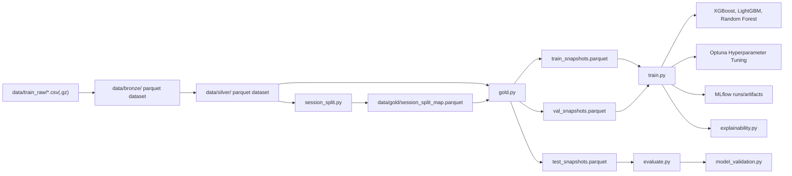

# Week 2 Training Pipeline Plan

## Bối Cảnh Và Giả Định

- Week 1 executable hiện có: `dvc.yaml` chỉ chạy `bronze -> silver`, output là `data/bronze/events.parquet` và `data/silver/events.parquet`.
- Blueprint Week 2 yêu cầu: global session index, session-boundary split, gold snapshots, 10-minute label, feature engineering, multi-model training, MLflow, SHAP, data lineage, model validation gate.
- Giả định plan Week 2 ưu tiên `DEV_SMOKE` chạy được end-to-end trên local, không mở rộng sang Week 3+ như Kafka, Redis, FastAPI serving, dashboard.
- Week 2 phải migrate bronze/silver từ single parquet file sang directory-based parquet datasets (`data/bronze/`, `data/silver/`) để khớp roadmap verification contract và tránh memory bottleneck ở `gold`/`train`.
- Quyết định train model: giữ native `XGBoost`, `LightGBM`, `Random Forest` theo blueprint và dùng `Optuna` để Hyperparameter Tuning. DEV smoke có thể giảm số trials để chạy nhanh, nhưng target-state vẫn giữ tuning đầy đủ.

## Phương Án Cân Nhắc

- Phương án A: làm đủ target-state Week 2 ngay, gồm đổi bronze/silver sang directory, multi-model tuning đầy đủ, MLflow registry, SHAP, DVC push. Đúng blueprint nhất nhưng rủi ro cao vì chạm nhiều contract Week 1.
- Phương án B: vertical slice được chọn, gồm `raw -> bronze dataset -> silver dataset -> session_split -> gold -> train/evaluate -> MLflow local -> SHAP/gate`, dùng native models với Optuna trials giới hạn trong smoke config. Phương án này chạm bronze/silver nhưng vẫn tránh scope Week 3+.
- Phương án C: chỉ làm `session_split + gold`, hoãn training/MLflow. An toàn nhất nhưng chưa đạt milestone Training Pipeline.

## Kiến Trúc Week 2 Đề Xuất

## Scope Chính

- Thêm schema và constants cho gold layer trong `shared/schemas.py` và `shared/constants.py`.
- Refactor `training/src/bronze.py` để write `data/bronze/` như parquet dataset directory, preserve `source_event_time`, và giữ row-count parity so với Week 1.
- Refactor `training/src/silver.py` để read bronze dataset directory và write `data/silver/` như parquet dataset directory, vẫn giữ external sort / k-way merge semantics hiện có cho silver finalize.
- Tạo `training/src/session_split.py` để build session index toàn cục từ silver, split theo `session_start_time`, đảm bảo mỗi `user_session` chỉ nằm ở một split.
- Tạo `training/src/features.py` và `training/src/gold.py` để materialize snapshot rows chỉ dùng event quá khứ tại `t`, label `1` nếu có `purchase` trong `(t, t + 10 phút]` cùng session.
- Tạo `training/src/evaluate.py` để tính PR-AUC, F1, Precision, Recall, confusion matrix và threshold từ validation/test.
- Tạo `training/src/train.py` để train native `XGBoost`, `LightGBM`, `Random Forest` theo cùng interface, tune hyperparameters bằng `Optuna`, auto-select best theo validation PR-AUC, export model artifact, và log metrics/artifacts lên MLflow.
- Cấu hình Optuna: target-state 50 trials mỗi model theo blueprint; DEV smoke dùng env/config để giảm trials nhằm giữ vòng lặp local và CI nhanh.
- Tạo `training/src/explainability.py` để lưu SHAP summary plot và explainer cho best tree model bằng `shap.TreeExplainer`.
- Tạo `training/src/model_validation.py` để gate fail-closed, first deploy auto-pass, manual override phải có `override_by`, `override_reason`, `override_time`.
- Tạo `training/src/data_lineage.py` để tạo `raw_input_manifest.json` và log lineage lên MLflow: `raw_input_manifest_hash`, `raw_input_file_count`, `window_start_utc`, `window_end_utc`, `row_count_raw`, `row_count_bronze`, `row_count_silver`, `row_count_gold_*`, `data_source_type`, input/output artifact paths, và `dvc_data_revision`.
- Mở rộng `dvc.yaml` để track `bronze`, `silver`, `session_split`, `gold`, `train` theo directory outs. `bronze` output là `data/bronze/`, `silver` output là `data/silver/`; các downstream deps không được assume `events.parquet`.
- Cập nhật `pyproject.toml` với dependencies training cần thiết: `scikit-learn`, `xgboost`, `lightgbm`, `mlflow`, `shap`, `matplotlib`, `optuna`.
- Nếu cần MLflow local UI, mở rộng `docker-compose.yml` bằng service `mlflow` tối giản, không hardcode secrets mới.

## Docs Update Plan

- Đồng bộ `docs/BLUEPRINT/01_OVERVIEW.md`, `04_PIPELINES.md`, `05_PROJECT_STRUCTURE.md`, `07_TESTING.md`, và `12_ROADMAP.md` với contract `data/bronze/` và `data/silver/` là directory-based parquet datasets, không phải single-file artifacts.
- Giữ `docs/BLUEPRINT/12_ROADMAP.md` theo contract native multi-model: `XGBoost`, `LightGBM`, `Random Forest`, `Optuna` 50 trials target-state, model comparison theo validation PR-AUC.
- Cập nhật `docs/BLUEPRINT/04_PIPELINES.md` nếu cần để làm rõ DEV smoke có thể giảm Optuna trials qua config, còn target-state vẫn là 50 trials mỗi model.
- Cập nhật `docs/BLUEPRINT/02_ARCHITECTURE.md` để Technology Stack model row tiếp tục nêu native `XGBoost`, `LightGBM`, `Random Forest`; không nhắc lại phương án trainer đã bỏ.
- Cập nhật `docs/BLUEPRINT/05_PROJECT_STRUCTURE.md` để module plan cho `training/src/train.py` nêu rõ native trainer + Optuna, không thêm adapter cho phương án đã bỏ.
- Cập nhật `docs/BLUEPRINT/07_TESTING.md` để thêm tests cho Optuna config smoke, model candidate list, MLflow metrics/artifacts, và auto-selection theo PR-AUC.
- Cập nhật `docs/BLUEPRINT/09_EXPLAINABILITY.md` để giữ SHAP `TreeExplainer` cho tree-based native models.
- Cập nhật `docs/BLUEPRINT/01_OVERVIEW.md` nếu có đoạn model family cần đồng bộ với native training plan.
- Sau khi sửa docs, chạy stale-contract scan bằng search để đảm bảo không còn reference từ phương án trainer đã bỏ trong blueprint/code plan.

## Test Plan

- Thêm unit tests trong `training/tests/` cho session split disjointness, split ordering theo `session_start_time`, cross-session isolation.
- Thêm tests cho bronze/silver directory contract: output là dataset directory, không còn hard-code `data/bronze/events.parquet` hoặc `data/silver/events.parquet`, và bronze row-count parity vẫn giữ nguyên khi materialize dạng directory.
- Thêm tests cho feature builder: `total_views`, `total_carts`, `net_cart_count`, ratios, unique counts, duration, time since last event chỉ dựa vào events `<= t`.
- Thêm tests cho label horizon 10 phút: purchase đúng boundary `(t, t + 10 phút]`, khác session không được tính, nhiều purchase vẫn label `1`.
- Thêm tests cho gold output schema và không ghi cột internal tạm vào final artifact.
- Thêm tests cho `training/src/data_lineage.py`: manifest gồm path/size/modified_time/checksum, hash ổn định khi input không đổi, và MLflow params/artifacts đúng tên blueprint.
- Thêm tests cho validation gate theo contract trong `docs/BLUEPRINT/07_TESTING.md`: first deployment auto-pass, model mới beat production, model mới kém hơn fail, dưới min threshold fail, MLflow/registry lỗi fail-closed, manual override pass khi đủ `override_by`/`override_reason`/`override_time`, và manual override fail khi thiếu audit field.
- Thêm smoke integration test tạo DataFrame/parquet nhỏ rồi chạy `session_split -> gold -> train/evaluate` với Optuna trials rất nhỏ hoặc mock trainer để giữ CI nhanh.
- Thêm test cho trainer config để assert model candidates đúng là `XGBoost`, `LightGBM`, `Random Forest` và smoke trials thấp hơn target-state.
- Thêm docs consistency test hoặc repo-wide search check để đảm bảo không còn reference từ phương án trainer đã bỏ sau khi revert.

## Verification Commands

- `ruff check .`
- `pytest training/tests -q`
- `dvc dag`
- `dvc repro bronze silver session_split gold train` sau khi stages đã được thêm và data local sẵn sàng.
- `rg "data/bronze/events\\.parquet|data/silver/events\\.parquet" docs/BLUEPRINT training shared dvc.yaml` để đảm bảo không còn contract single-file cũ.
- `rg "H[2]O|Auto[M]L|include[_]algos|GBM[, ]+DRF" docs/BLUEPRINT training shared` để đảm bảo revert sạch khỏi phương án trainer đã bỏ.
- `PRE_COMMIT_HOME=/tmp/pre-commit-cache pre-commit run --all-files` trước khi chốt branch.

## Không Thuộc Week 2

- Không build Kafka, Quix Streams, Redis online feature store, FastAPI predict/explain, Streamlit dashboard, Prometheus/Grafana.
- Không đổi prediction API runtime config hay đưa DVC/MinIO credentials vào serving.
- Không implement online evaluation, retraining scheduler, drift alerts trừ khi cần stub/documentation cho lineage.

## Rủi Ro Và Cách Giảm

- Refactor bronze/silver sang directory có thể làm thay đổi DVC lock và artifact paths: thực hiện trước `session_split`, thêm row-count parity tests, và chạy stale-contract scan trước khi train.
- Data size lớn: gold snapshot có thể phình nhanh, nên implement batch/group-by-session và thêm smoke dataset test trước.
- Leakage: test bắt buộc chứng minh features chỉ dùng quá khứ tại snapshot time `t`.
- Optuna target-state 50 trials mỗi model có thể chậm trên local: dùng config smoke để giảm trials khi test/CI, nhưng không đổi contract target-state.
- Dependency native models nặng hơn Week 1: thêm đúng package cần thiết và giữ train smoke trên sample nhỏ.
- MLflow registry local có thể chưa sẵn: tách logic validation gate để unit test được bằng mock trước khi chạy registry thật.
